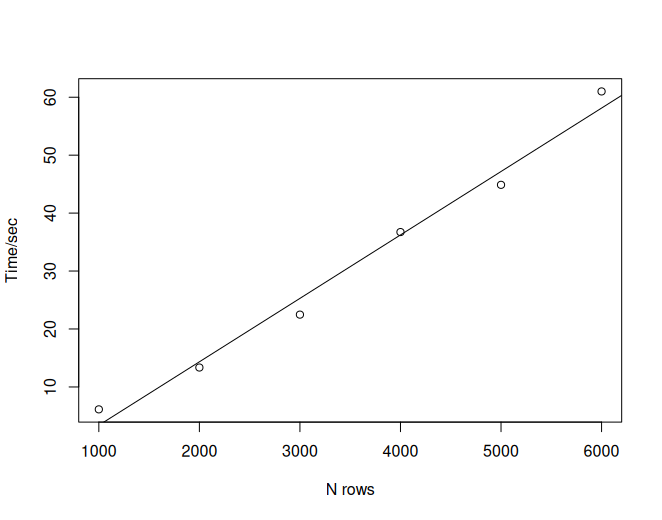

```{r, include = FALSE}
knitr::opts_chunk$set(
  collapse = TRUE,
  comment = "#>"
)
```

```{css, echo=FALSE}
pre {
  max-height: 800px !important;
}
```

## Introduction

For submission, sometimes listings are required. Sometimes large listings can include thousands of patients and tens of thousands of rows. Exporting such large listing files is time-consuming and memory-heavy, and it is not obvious if the job is still ongoing or is already dead. The time cost is mostly due to paginating the listing object into multiple pages.

Consider the following example:

```{r, eval = FALSE}
library(rlistings)

iris2 <- do.call(rbind, rep(list(iris), 40))
rlist <- as_listing(iris2, key_cols = "Species",
                    disp_cols = c("Sepal.Length", "Sepal.Width", "Petal.Width", "Petal.Length"))

bench::mark(
  a = paginate_to_mpfs(rlist[1:1000, ]),
  b = paginate_to_mpfs(rlist[1:2000, ]),
  c = paginate_to_mpfs(rlist[1:3000, ]),
  d = paginate_to_mpfs(rlist[1:4000, ]),
  e = paginate_to_mpfs(rlist[1:5000, ]),
  f = paginate_to_mpfs(rlist[1:6000, ]),
  check = FALSE,
  max_iterations = 1
)
```

It gives the following benchmark results:

```         
  expression      min median `itr/sec` mem_alloc `gc/sec` n_itr  n_gc total_time
  <bch:expr> <bch:tm> <bch:>     <dbl> <bch:byt>    <dbl> <int> <dbl>   <bch:tm>
1 a             6.13s  6.13s    0.163     2.17GB    0.816     1     5      6.13s
2 b            13.35s 13.35s    0.0749    8.63GB    1.42      1    19     13.35s
3 c            22.48s 22.48s    0.0445   19.38GB    1.74      1    39     22.48s
4 d            36.73s 36.73s    0.0272   34.41GB    1.80      1    66     36.73s
5 e            44.88s 44.88s    0.0223   53.72GB    1.63      1    73     44.88s
6 f             1.01m  1.01m    0.0166   77.32GB    1.72      1   104      1.01m
# ℹ 4 more variables: result <list>, memory <list>, time <list>, gc <list>
```

It is obvious that the time consumption grows linearly as the rows of data increase.



To decrease the runtime and prevent memory issues, we would recommend splitting the listing object by a grouping variable and exporting the output separately. Consider the following demonstration:

```{r, eval = FALSE}
iris3 <- cbind(iris2, gp = rep(c(1, 2, 3, 4, 5, 6), 1000))
rlist3 <- as_listing(iris3, key_cols = "Species",
                     disp_cols = c("Sepal.Length", "Sepal.Width", "Petal.Width", "Petal.Length"))

start.time <- Sys.time()
rlist3  %>% split(rlist3$gp) %>% lapply(., paginate_to_mpfs)
end.time <- Sys.time()

time.taken <- end.time - start.time
time.taken

# > Time difference of 36.06119 secs
```

In principle, you could consider processing this work with multi-threading to further reduce the runtime.

```{r, eval = FALSE}
library(parallel)

start.time <- Sys.time()
rlist3  %>% split(rlist3$gp) %>% mclapply(., paginate_to_mpfs)
end.time <- Sys.time()

time.taken <- end.time - start.time
time.taken

#> Time difference of 18.20406 secs
```

